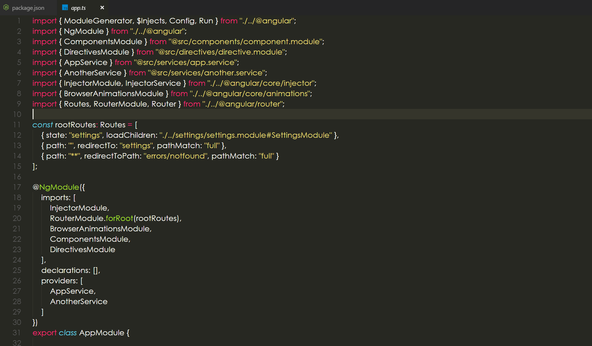
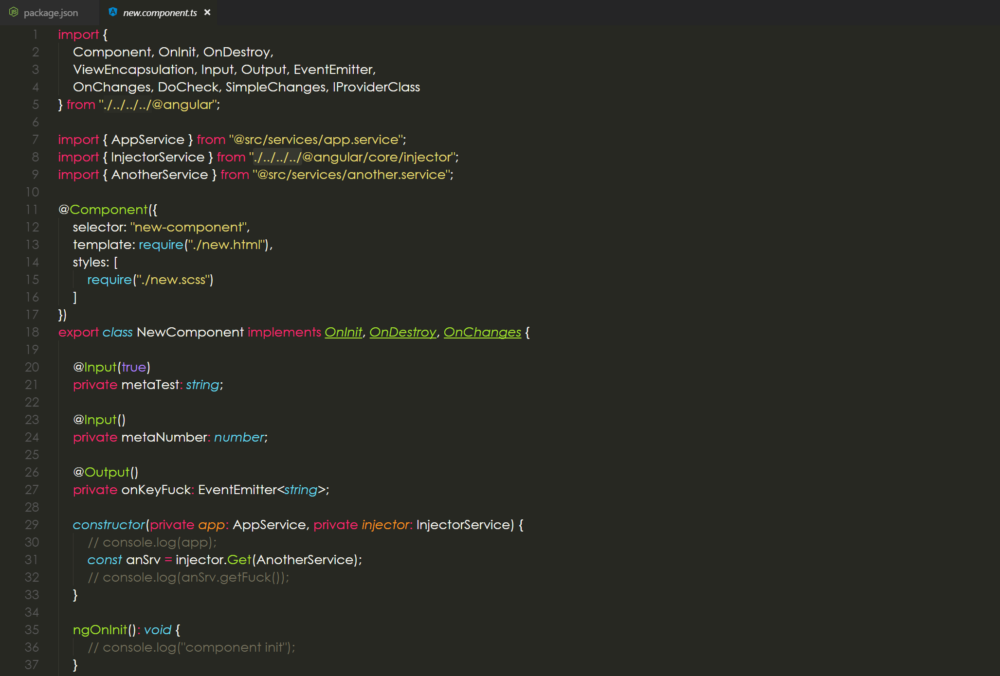
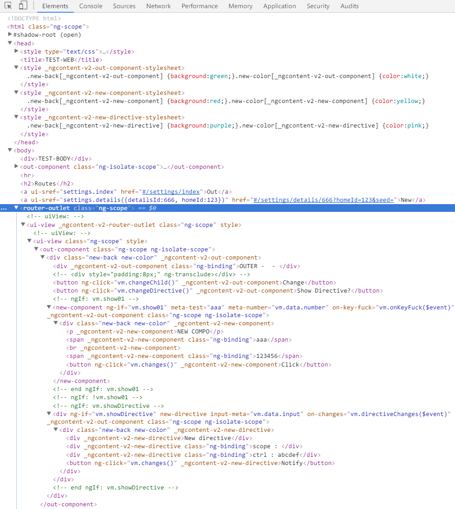
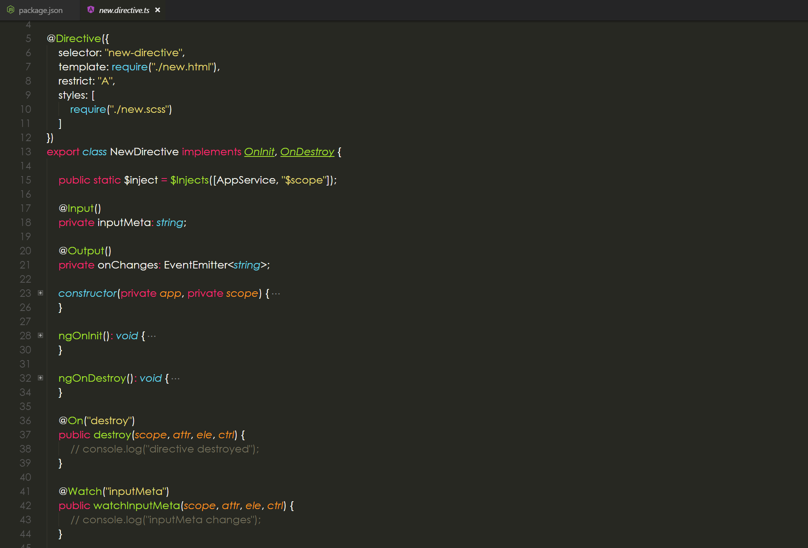
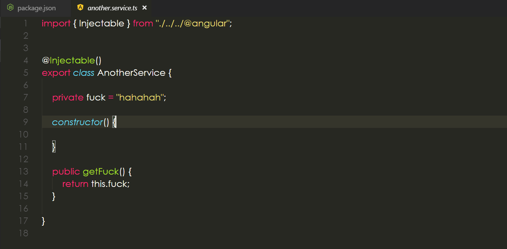
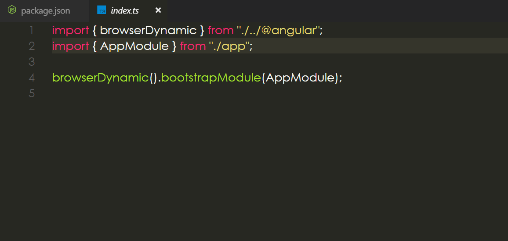
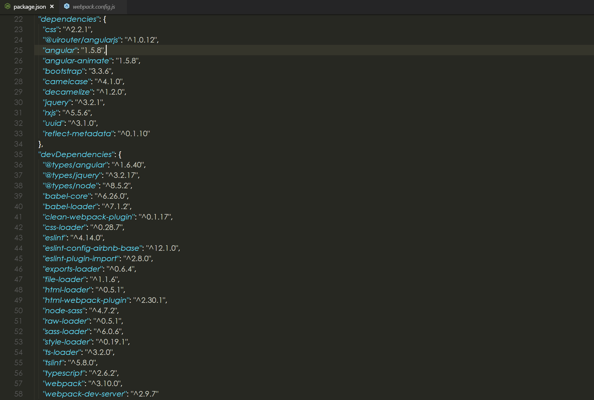

# ws-angular-x
the new syntax of angular 1.x (1.5.8+)

[](https://travis-ci.org/ws-types/ws-angular-x)

## Break changes:
#### 2018-01-09 [ version : 1.1.2 ] - [old : 1.1.1] :
  in Router(service), the "params" Subject is not provided anymore and the "stateChanges" Subject's type is changed. you can get each transition result { to, from, params, path} in this Subjevt's subscription.

## NOTES:
### 1. All code are built in ES5(commonjs) mode, if you're using a higher version, please use babel-loader;
### 2. Anyway, better not run this code in the ES3 environment if you work with javascript, try ES6/ES5 or babel-loader.
### 3. If running in the prod mode ,conf the UglifyJS to ignore mangle options because the injection service of angular1.x will breaks by uglify. Keep mangle off or try to provide a reserved arr list to prevent uglify breaks the constructor's params name. I'll provide all the injections need later if possible. (now you can use the reserved list in "./webpack/@ngtools/uglify-reserved/index.js", all the angular and ui-router's injection-services will work well with uglifyjs.)

## 1. Module in Declaration



ng4+ syntax for module creation.

## 2.Component with all lifyCycle hooks



codeing like ng4+ is possible!



support view encapsulation:

encapsulation: ViewEncapsulation.Emulated | ViewEncapsulation.None

you can make your css/scss/less works only in component scope, or control component encapsulation to global or emulated.

## 3. Powerful directive



more lifeCycle hooks and On/Watch events supported.

encapsulation mode is also supported!

## 4.Service without name selector any more



only to inject and use it.

## 5. More like angular 4+



even the bootstrap method...

## 6. All dependency, it's real angular1.x



==============================

### how to use

1. install by npm

```npm
npm install ws-angular-x --save
```
2. config webpack
```javascript
// it's only a demo, config by yourself with what you need.

const path = require('path');
const webpack = require("webpack");
const HtmlWebpackPlugin = require('html-webpack-plugin');
const CleanWebpackPlugin = require('clean-webpack-plugin');
const ForkTsCheckerWebpackPlugin = require('fork-ts-checker-webpack-plugin');


// you may get this loader in this package, try to get from "ws-angular-x/webpack/@ngtools/css-object-loader.js", 
// you can't get it from npm ...
// your component css/scss/less will not work without this loader.
const cssObjectLoader = path.resolve(__dirname, "node_modules/ws-angular-x/webpack/@ngtools/css-object-loader");

// the router-loader for angular-x
// you can conf lazy-load module by example like `{ state: "lazy", loadChildren: "./lazy/lazy.module#LazyModule" }` to create lazy router instead of use "import(......)"
const NgXRouterLoader = path.resolve(__dirname, "node_modules/ws-angular-x/webpack/@ngtools/angularX-router-loader");
// you can only provider css and template's url instead of require(......) by this loader
const NgXTemplateLoader = path.resolve(__dirname, "node_modules/ws-angular-x/webpack/@ngtools/angularX-template-loader");

// prod mode .
const UglifyJsPlugin = require('uglifyjs-webpack-plugin')
// a reserved list is provided.
const allReserved = require("node_modules/ws-angular-x/webpack/@ngtools/uglify-reserved");

module.exports = {
entry: {
        vendor: [ "ws-angular-x" ],
        index: [ "src/app/index.ts" ]
    },
    output: {
        path: path.resolve(__dirname, "dist"),
        filename: "[name].bundle.js",
        publicPath: "",
        chunkFilename: "[name].chunk.js"
    },
    plugins: [
        new CleanWebpackPlugin(['dist']),
        new HtmlWebpackPlugin({
            template: "./index.html"
        }),
        new webpack.optimize.CommonsChunkPlugin({
            name: 'vendor',
            chunks: ['index']
        }),
        // if "$" is needed as global, conf this.
        new webpack.ProvidePlugin({
            $: "jquery",
            jQuery: 'jquery',
            "window.jQuery": "jquery"
        }),
        new ForkTsCheckerWebpackPlugin(),
        // add this plugin for production mode.
        new UglifyJsPlugin({
            uglifyOptions: {
                mangle: { // add reserved list for injections
                    reserved: allReserved.all(allReserved)
                }
            }
        })
    ],
    resolve: {
        alias: { // ignore this, or you can change this by what your want.
            "@app": path.resolve(__dirname, "src/app")
        },
    },
    devtool: "source-map",
    devServer: {
        contentBase: './dist'
    },
    node: {
        fs: "empty"
    },
    module: {
        rules: [
            {
                test: /\.js$/,
                include: [
                    path.resolve(__dirname, "src/app")
                ],
                use: [
                    {
                        loader: "babel-loader",
                        options: {
                            // support ES7 decorators 
                            plugins: ['transform-runtime', 'transform-decorators-legacy'],
                            // support ES7 decorators and transform ES6 js to "commonjs"
                            presets: ['stage-0', 'es2015'],
                        }
                    },
                    { loader: NgXTemplateLoader + "?keepUrl=false" },
                    { loader: NgXRouterLoader + "?debug=false&loader=system" }
                ]
            },
            {
                test: /\.ts$/,
                exclude: /node_modules/,
                use: [
                    {
                        loader: 'ts-loader',
                        options: { // disable type check to make building action faster
                            transpileOnly: true
                        },
                    },
                    { loader: NgXTemplateLoader + "?keepUrl=false" },
                    { loader: NgXRouterLoader + "?debug=false&loader=system" }
                ]
            },
            {
                test: /\.css$/,
                use: [
                    // load css as object
                    cssObjectLoader,
                    'css-loader'
                ]
            },
            {
                test: /\.(sass|scss)$/,
                use: [
                    cssObjectLoader,
                    'sass-loader'
                ]
            },
            {
                test: /\.(png|svg|jpg|gif|woff|woff2|eot|ttf|otf)$/,
                use: [
                    'file-loader'
                ]
            },
            {
                include: [path.resolve(__dirname, "index.html")],
                test: /\.html$/,
                use: [
                    "raw-loader"
                ]
            },
            {
                include: [path.resolve(__dirname, "src/web-test")],
                test: /\.html$/,
                use: [
                    "html-loader"
                ]
            }
        ]
    }
}
```
3. import ws-angular-x into your code, and create your module
```typescript
import { Config, Run, NgModule } from "ws-angular-x";
import { ComponentsModule } from "@app/components/component.module";
import { DirectivesModule } from "@app/directives/directive.module";
import { AppService } from "@app/services/app.service";
import { AnotherService } from "@app/services/another.service";
import { InjectorModule, InjectorService } from "ws-angular-x/core/injector";
import { BrowserAnimationsModule } from "ws-angular-x/core/animations";
import { Routes, RouterModule, Router } from "ws-angular-x/router";

const rootRoutes: Routes = [
    { state: "lazy", loadChildren: "./lazy/lazy.module#LazyModule" },
    { state: "home", component: FirstComponent },
    { path: "", redirectTo: "home" },
    { path: "**", redirectToPath: "errors/notfound" }
];

// your module mey like this.
@NgModule({
    imports: [
        InjectorModule,
        RouterModule.forRoot(rootRoutes),
        BrowserAnimationsModule,
        ComponentsModule,
        DirectivesModule
    ],
    declarations: [
        FirstComponent
    ],
    providers: [
        AppService,
        AnotherService
    ]
})
export class AppModule {

    @Run("@injector", "@router")
    public configInjects(injector: InjectorService, router: Router) {
        console.log(router.RoutesTree);
    }

}

```
4. bootstrap your app now!
```typescript
import { browserDynamic } from "ws-angular-x";
import { AppModule } from "./app";

browserDynamic().bootstrapModule(AppModule);

```

5. don't for get your tsconfig.json if you work with typescript
```json
{
    "compilerOptions": {
        "outDir": "./dist",
        "baseUrl": ".",
        "sourceMap": true,
        "declaration": false,
        "moduleResolution": "node",
        "emitDecoratorMetadata": true,
        "experimentalDecorators": true,
        "allowJs": true,
        "target": "es5",
        "module": "commonjs",
        "typeRoots": [
            "node_modules/@types"
        ],
        "paths": {
            "@app": [
                "src/app/index"
            ],
            "@app/*": [
                "src/app/*"
            ]
        },
        "lib": [
            "es2016",
            "dom"
        ]
    }
}
```
6. if you work with javascript and eslint, you should conf your eslintrc.yml (or maybe *.json) to enable decorators. (as example)

```json
 "babel-core": "^6.26.0",
 "babel-eslint": "^8.1.2",
 "babel-plugin-transform-decorators-legacy": "^1.3.4",
 "babel-plugin-transform-runtime": "^6.23.0",
 "babel-preset-es2015": "^6.24.1",
 "babel-preset-stage-0": "^6.24.1",
 "eslint-plugin-babel": "^4.1.2",
```

```yaml
parser: babel-eslint
plugins:
  - babel
parserOptions:
  sourceType: module
  allowImportExportEverywhere: false
  codeFrame: false
rules: 
  strict: 0
```
============================

### animation module and other features are still in working....
